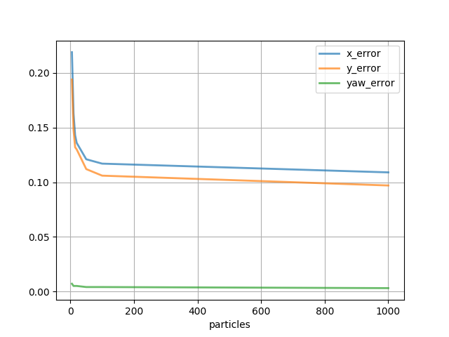
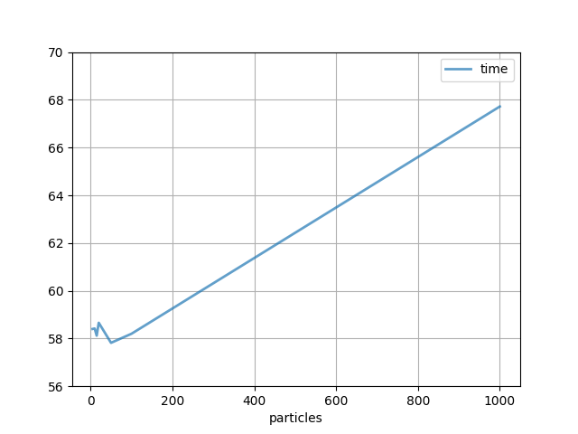
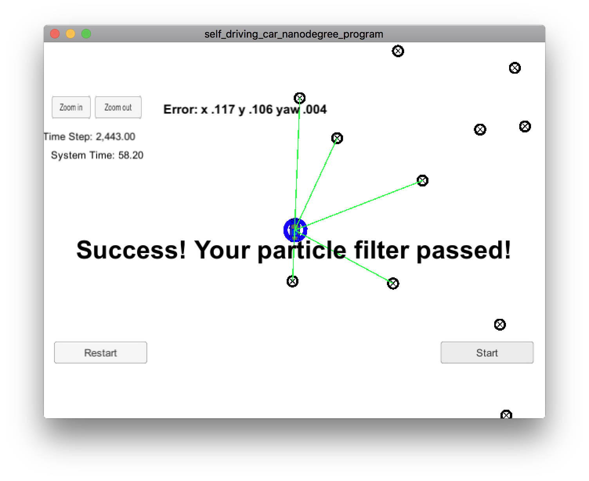
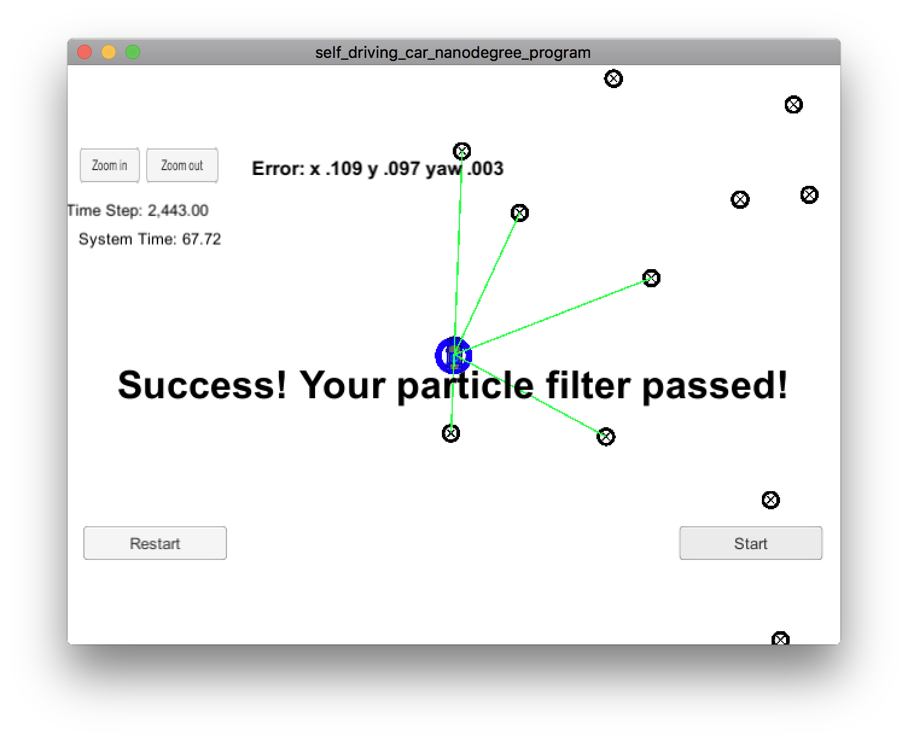

# Overview
This repository contains all the code needed to complete the final project for the Localization course in Udacity's Self-Driving Car Nanodegree.

# About

This code is designed to run with the Term2 simulator. Use the original code repository for instructions on how to run: 
[https://github.com/udacity/CarND-Kidnapped-Vehicle-Project](https://github.com/udacity/CarND-Kidnapped-Vehicle-Project).

# Results

The following table sums up the results of the execution. After 20 particles, to obtaining better performance you have 
to add significantly more particles. Execution time seems to be an issue only with large numbers of particles.

|Particles| x_error| y_error| yaw_error| system time |
|:-------:|:------:|-------:|:--------:|:-----------:|
|    **5**|    .219|    .194|      .007|        58.40|
|   **10**|    .163|    .148|      .005|        58.42|
|   **15**|    .143|    .132|      .005|        58.12|
|   **20**|    .136|    .130|      .005|        58.66|
|   **50**|    .121|    .112|      .004|        57.82|
|  **100**|    .117|    .106|      .004|        58.20|
| **1000**|    .109|    .097|      .003|        67.72|

##### The 2 graphs below provide a better understanding of what it is happening.

# Raw results

The following are the results of the execution as screenshots of the simulator.

### 5 particles

### 10 particles

### 15 particles

### 20 particles

### 50 particles

### 100 particles

### 1000 particles

